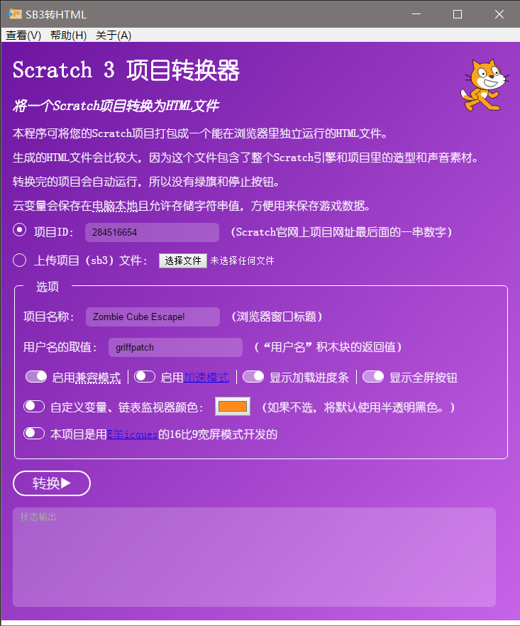

# Scratch 3 到 HTML 转换器

[](https://github.com/fengshuo2004/SB3toHTML/blob/master/LICENSE)

## 总览

SB3toHTML通过将一个Scratch项目连同所需的scratch虚拟机打包在一起，将这个项目转换成独立的单个html文件。

相比于分发sb3项目文件，直接分发html文件解决了需要额外安装Scratch编辑器的不便（仍然需要支持HTML5的网页浏览器）；同时也能提高抄袭源码的成本，一定程度上保护您的项目。



核心代码分叉自Sheep_maker的仓库，本程序把Scratch 3项目（.sb3文件）转换为独立的HTML文件。

我使用NodeJS Electron将此程序打包成Windows/MacOS/Linux执行档，还顺便对原本的用户界面进行了美观性打磨。

## 构建

> ⚠ 由于一些文件的引用方式，您必须先**构建**再调试！

如果您想自己开发和构建本项目，您需要Git命令行、NodeJS环境和NPM包管理器。遵循以下步骤：

1. 用git克隆这个仓库到本地：

```bash
git clone https://github.com/fengshuo2004/SB3toHTML.git
cd SB3toHTML
```

2. NPM安装需要的依赖：

```bash
npm install
```

3. 根据您的平台构建二进制：

```bash
npm run dist
```

4. Electron-builder会在本目录下创建一个名为`dist`的文件夹，在里面构建二进制文件。不同系统会生成不同的目录，Windows系统是这样的：

```
📂 SB3toHTML (本目录)
 → 📂 dist
    → 📂 win-unpacked
       → 📄 scratch3-packager.exe
```

5. 运行这个可执行文件即运行主程序

## 计划

将来会支持这些新功能（按优先级从大到小排列)

- [ ] 支持拖动文件进窗口作为sb3项目
- [ ] 给Windows安装程序添加签名
- [ ] 将分支更新到与SheepTester的Master平行，这会带来如连接到云变量服务器、“加载中”占位图等新功能