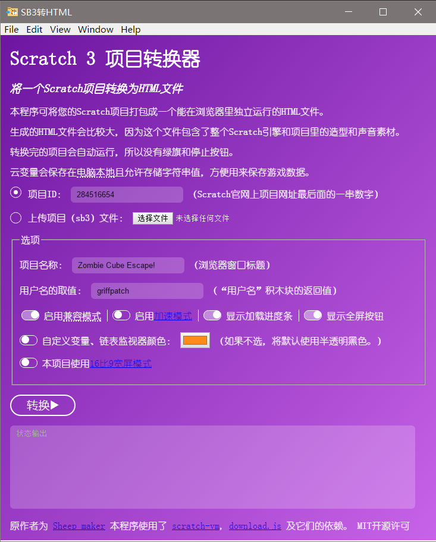

# Scratch 3 to HTML Converter

> ⚠ WARNING: WORK IN PROGRESS! NOT YET USABLE! CHINESE LANG UI ONLY!

Core code forked from **Sheep_maker**'s repository, this program converts Scratch 3 projects (.sb3 files) into stand-alone HTML files.

I used NodeJS Electron to pack this program into a Windows/MacOS/Linux Executable, along with a cosmetic overhual of the original UI.

> ⚠ 警告：仍在开发过程中，尚不能运行！界面语言仅限中文！

核心代码分叉自Sheep_maker的仓库，本程序把Scratch 3项目（.sb3文件）转换为独立的HTML文件。

我使用NodeJS Electron将此程序打包成Windows/MacOS/Linux执行档，还顺便对原本的用户界面进行了美观性打磨。